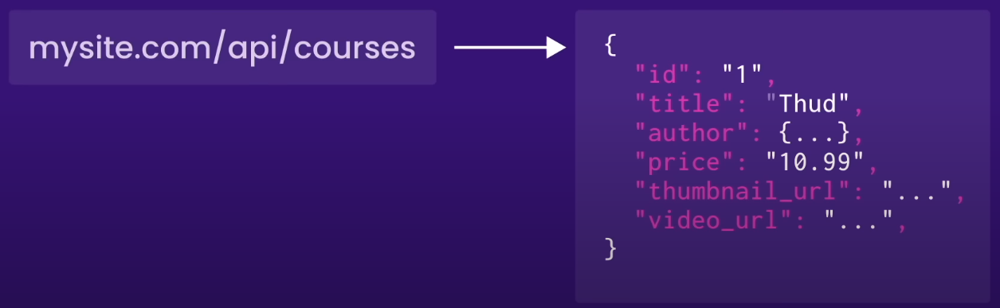
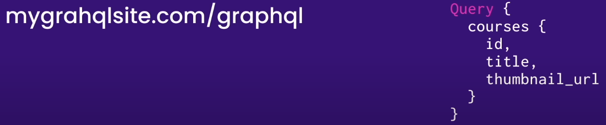
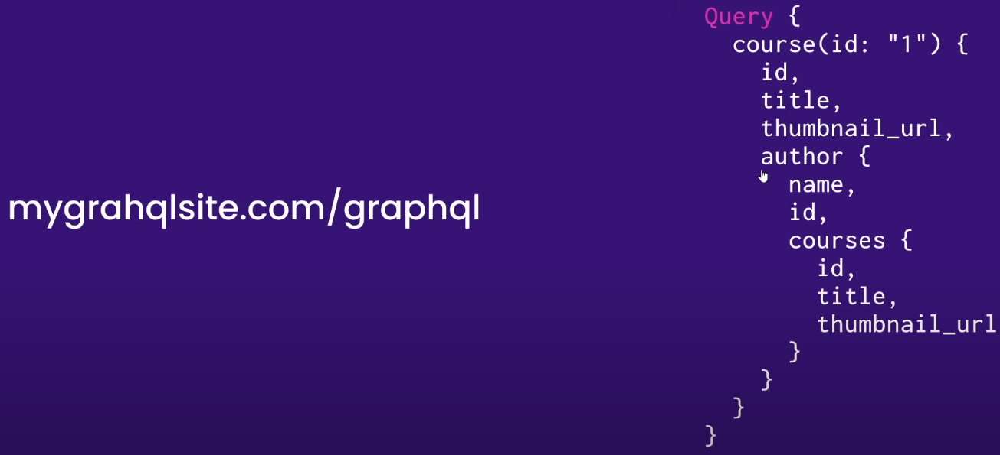

# Introduction to GraphQL

At its core, GraphQL enables declarative data fetching where a client can specify exactly what data it needs from an API. Instead of multiple endpoints that return fixed data structures, a GraphQL server only exposes a single endpoint and responds with precisely the data a client asked for.

**1. GraphQL is a Query Language**

GraphQL is a query language for APIs. It allows clients to request the specific data they need, and the server responds with exactly that data, nothing more and nothing less.

**2. GraphQL != Database**

GraphQL is often confused with being a database technology. This is a misconception, GraphQL is a query language for APIs - not databases. In that sense it’s database agnostic and effectively can be used in any context where an API is used.

**3. Query Language for Getting Data**

GraphQL is used for fetching data, whether it's from a database, a REST API, or any other data source. It provides a unified way to request data regardless of where it comes from.

**4. GraphQL as a Middleware Layer**

GraphQL acts as a middleware layer between the frontend and backend. It takes incoming queries from clients, processes them, and fetches the requested data from the appropriate data sources.

**5. Client Requests Data using GraphQL**

Clients make queries to a GraphQL API, specifying the structure of the data they want. The server processes these queries and returns a JSON response that matches the query's structure.

**6. Query Languages for Getting Data from Databases**

Traditional query languages like SQL are typically used for getting data from relational databases. In contrast, GraphQL is a more flexible and versatile way to request data from various sources, including databases, RESTful services, and more.

## Difference Between REST and GQL

**1. Type of Requests**

GraphQL itself doesn't prescribe the use of specific HTTP methods, it's common practice to use HTTP POST for GraphQL requests. This is because GraphQL queries and mutations are sent as JSON payloads in the request body. However, some GraphQL APIs may also support using GET requests for queries, although it's less common due to limitations in request size and security concerns.

<table>
    <thead>
        <tr>
            <th>Sr. No.</th>
            <th>Rest API</th>
            <th>GraphQL API</th>
        </tr>
    </thead>
    <tbody>
        <tr>
            <td rowSpan="4">1</td>
            <td>GET</td>
            <td rowSpan="4">POST</td>
        </tr>
        <tr>
            <td>POST</td>
        </tr>
        <tr>
            <td>UPDATE</td>
        </tr>
        <tr>
            <td>DELETE</td>
        </tr>
    </tbody>
</table>

**2. Type of Methods**

GraphQL itself primarily consists of two core operations: queries for fetching data and mutations for making changes.

<table>
    <thead>
        <tr>
            <th>Sr. No.</th>
            <th>Rest API</th>
            <th>GraphQL API</th>
        </tr>
    </thead>
    <tbody>
        <tr>
            <td>1</td>
            <td>GET</td>
            <td>Query</td>
        </tr>
        <tr>
            <td rowSpan="3">2</td>
            <td>POST</td>
            <td rowSpan="3">Mutation</td>
        </tr>
        <tr>
            <td>UPDATE</td>
        </tr>
        <tr>
            <td>DELETE</td>
        </tr>
    </tbody>
</table>

**3. End Points**

REST APIs typically utilize multiple endpoints to handle various resource operations, whereas GraphQL APIs commonly consolidate these operations into a single endpoint for increased flexibility and efficiency.

<table>
    <thead>
        <tr>
            <th>Sr. No.</th>
            <th>Rest API</th>
            <th>GraphQL API</th>
        </tr>
    </thead>
    <tbody>
        <tr>
            <td>1</td>
            <td>Multiple</td>
            <td>Single</td>
        </tr>
        <tr>
            <td rowSpan="4">2</td>
            <td>/api/auth/register</td>
            <td rowSpan="4">/api/user</td>
        </tr>
        <tr>
            <td>/api/auth/login</td>
        </tr>
        <tr>
            <td>/api/auth/logout</td>
        </tr>
        <tr>
            <td>/api/user/me</td>
        </tr>
    </tbody>
</table>

**4. Under fetching**

Rest API's may result in getting back more data than we need

**5. Over fetching**

Rest API's may result in getting back less data than we need

## Learning Resources

- [Learn GraphQL - From Beginner to Expert](https://youtu.be/yqWzCV0kU_c?si=ZSstMxXF1bOZz3Ll)
- [GraphQL Course for Beginners](https://youtu.be/5199E50O7SI?si=Dq85puAOI9U2m7X_)
- [The Fullstack Tutorial for GraphQL](https://www.howtographql.com/)
