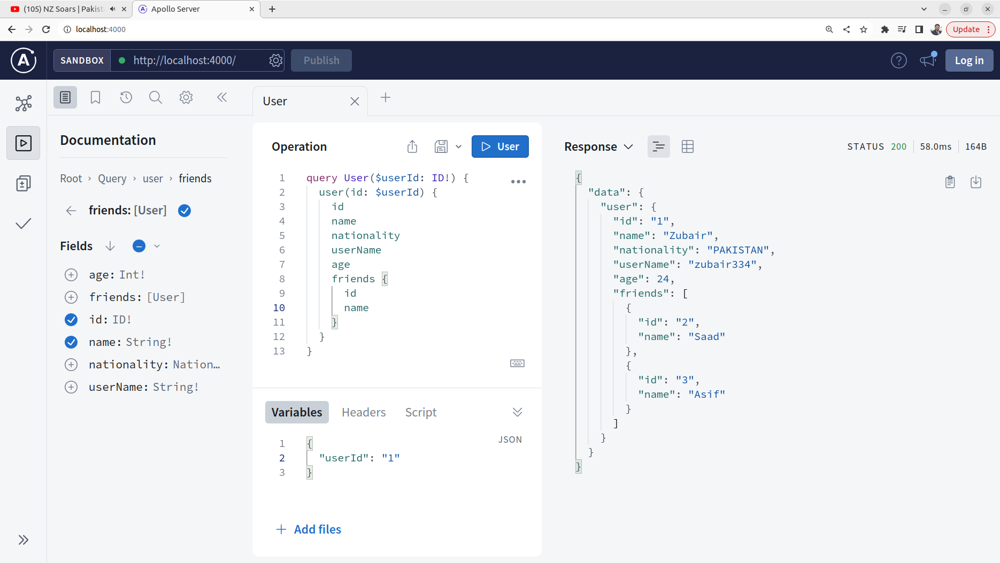

# Defining Queries Part 01

1. Once you have completed [Defining Queries 01](../step07c_defining_queries_01/) run the following in two different terminals

   ```bash
   tsc -w
   ```

   ```bash
   npm start
   ```

2. When specifying the `User` type, it's beneficial to replace the `String` type for the nationality field with an `ENUM`. Since we have a finite and specific set of countries, using an enumeration ensures that only valid nationalities can be assigned to users. This not only enhances the clarity of the schema by explicitly listing allowed values but also prevents potential errors or inconsistencies in the data, providing a more robust and self-explanatory GraphQL API. Update `src/schema/typeDefs.ts` to define an enum

   ```graphql
   enum Nationality {
     PAKISTAN
     CHINA
     INDIA
     USA
     CANADA
   }
   ```

   Update the `nationality` filed of the user type with the following

   ```graphql
   nationality: [Nationality]!;
   ```

3. We have the flexibility to incorporate any type within its respective definition. Now, let's introduce a new field called `friends` to the `User` type. Add the following field to the definition of the `User` type.

   ```graphql
   friends: [User];
   ```

4. Just to be clear while running the query update `src/data/data.ts` to add friends to the data. Replace the content of the file with the following.

   ```ts
   export const usersList = [
     {
       id: "1",
       name: "Zubair",
       userName: "zubair334",
       age: 24,
       nationality: "PAKISTAN",
       friends: [
         {
           id: "2",
           name: "Saad",
           userName: "saad007",
           age: 20,
           nationality: "CHINA",
         },
         {
           id: "3",
           name: "Asif",
           userName: "asif1009",
           age: 32,
           nationality: "INDIA",
         },
       ],
     },
     {
       id: "2",
       name: "Saad",
       userName: "saad007",
       age: 20,
       nationality: "CHINA",
     },
     {
       id: "3",
       name: "Asif",
       userName: "asif1009",
       age: 32,
       nationality: "INDIA",
     },
     {
       id: "4",
       name: "Ali",
       userName: "ali123",
       age: 35,
       nationality: "USA",
       friends: [
         {
           id: "3",
           name: "Asif",
           userName: "asif1009",
           age: 32,
           nationality: "INDIA",
         },
       ],
     },
     {
       id: "5",
       name: "Minsa",
       userName: "minsa2020",
       age: 3,
       nationality: "CANADA",
     },
   ];
   ```

5. Now add a new query to get a single user based on some id provided as an argument. Update `src/schema/typeDefs.ts`

   ```graphql
   user(id: ID!): User
   ```

6. Update `src/resolvers/resolvers.ts` and add a `user` resolver

   ```ts
   user: (_: any, args: { id: string }) =>
     usersList.find((user) => user.id === args.id),
   ```

   This resolvers gets the user from the data based on provided ID

7. After all the changes we made, `schema` should look like this

   ```ts
   export const typeDefs = `#graphql
   
       type User {
       id: ID!
       name: String!
       userName: String!
       age: Int!
       nationality: Nationality!
       friends: [User]
       }
   
       enum Nationality {
           PAKISTAN
           CHINA
           INDIA
           USA
           CANADA
       }
     
       type Query {
       users: [User!]!
       user(id: ID!): User
       }
         
   `;
   ```

   `resolvers` should look as follows

   ```ts
   import { usersList } from "../data/data.js";

   export const resolvers = {
     Query: {
       users: () => usersList,

       user: (_: any, args: { id: string }) =>
         usersList.find((user) => user.id === args.id),
     },
   };
   ```

8. Navigate to http://localhost:4000/ in the browser and run the query as follows

   
